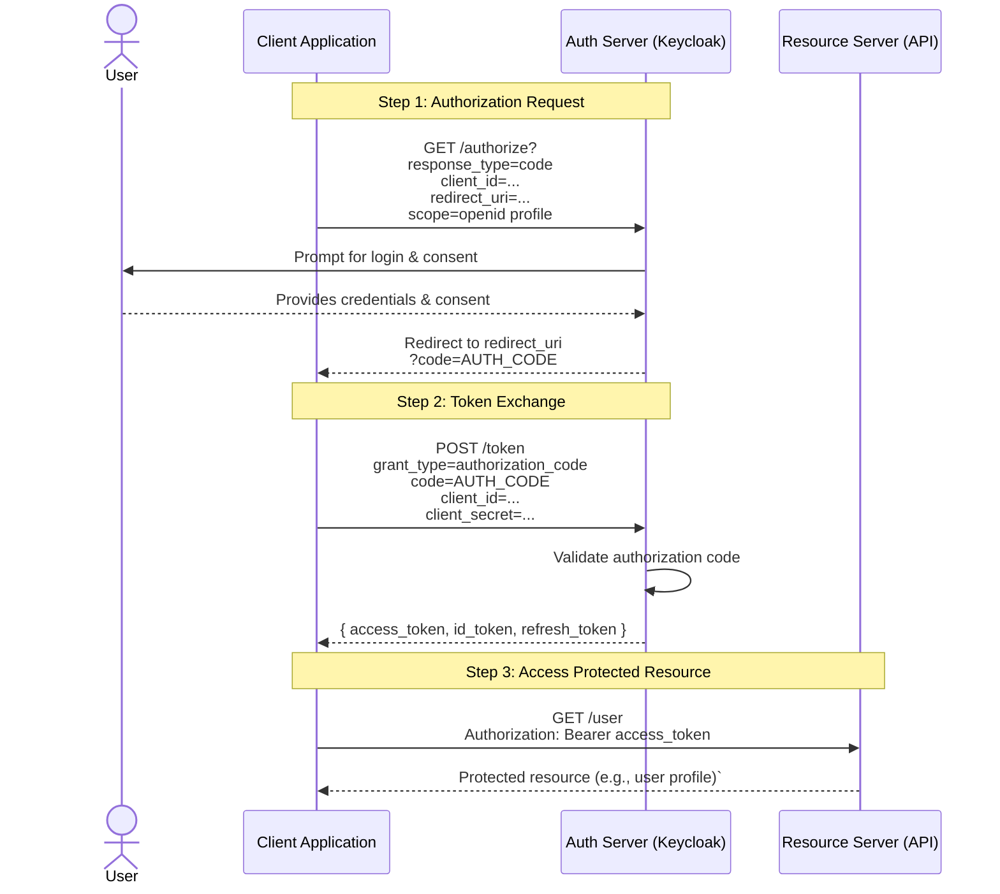
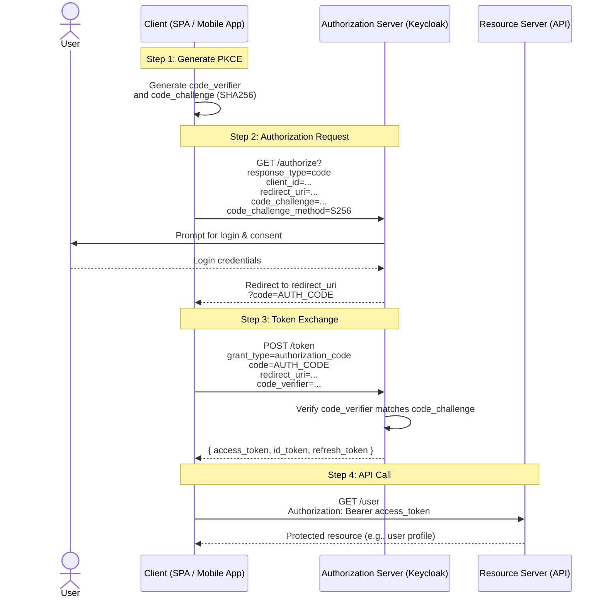

# Introduction to OAuth 2.0 and OpenID Connect

Understanding modern authentication and authorization using **Keycloak**

<!-- pause -->

## Why OAuth 2.0?

- **OAuth 2.0** is the industry-standard protocol for **authorization**.
- Lets users **share limited access** to data with third-party apps — _without sharing credentials_.
- Provides **fine-grained control** over what data is shared and for how long.
- OAuth is about **delegating access**, not authenticating users.

<!-- end_slide -->

# Roles in OAuth 2.0

---

| Role                     | Description                                                                 |
| ------------------------ | --------------------------------------------------------------------------- |
| **Resource Owner**       | The end user who owns the data or resources.                                |
| **Resource Server**      | Hosts protected resources (e.g., an API).                                   |
| **Client**               | App requesting access on behalf of the Resource Owner.                      |
| **Authorization Server** | Issues tokens after successful authorization (e.g., Keycloak, Auth0, Okta). |

<!-- end_slide -->

# What is OpenID Connect (OIDC)?

---

- **OAuth 2.0** handles _authorization_ → “Can this app access data?”
- **OpenID Connect** adds _authentication_ → “Who is the user?”

<!-- pause -->

- OAuth => _Access Delegation_
- OIDC => _Identity Layer on top of OAuth_

<!-- pause -->

✅ OIDC can enable **Single Sign-On (SSO)** across apps

✅ Provides a **standardized way** to verify user identity and retrieve profile info

<!-- end_slide -->

# OpenID Connect (OIDC) Core Concepts

---

There are 3 tokens used in OpenID Connect:

- **ID Token** → JWT with user identity claims (`sub`, `email`, `name`, etc.) -> Mainly for UIs
- **Access Token** → Used by the client to access APIs
- **Refresh Token** → Used to renew access tokens (often in the background)

**OIDC extends OAuth 2.0** with the following endpoints:

- `/userinfo` → Retrieve profile information
- `/introspect` → Check token validity
- `/logout` → Handle single logout across clients

<!-- end_slide -->

## Token Formats

---

While JWT (JSON Web Token) is often used with OAuth 2.0, the OAuth 2.0 specification itself never mandates JWT usage.

### The Access Token in OAuth 2.0 can be opaque, meaning:

- It’s just a random string. Example: 2YotnFZFEjr1zCsicMWpAA
- The Resource Server must introspect it via the /introspect endpoint on the Authorization Server to learn its content (like scope, expiry, user info).

### Some providers (like Keycloak, Auth0, Okta) choose to issue JWT access tokens, because:

- JWTs are self-contained (no introspection needed).
- They carry claims directly in the payload (e.g., sub, scope, aud).

### For OpenID Connect, however, at least one token must be a JWT:

- The ID Token is always a JWT.
- It contains identity claims about the authenticated user:
  - Example: sub, email, preferred_username, iss, aud

<!-- end_slide -->

## About JWT (JSON Web Token)

---

### JWTs are **compact, signed JSON objects** for securely transmitting claims.

**Structure:**

| Part          | Description                              |
| ------------- | ---------------------------------------- |
| **Header**    | Algorithm, type                          |
| **Payload**   | Claims (issuer, subject, audience, etc.) |
| **Signature** | Verifies token integrity                 |

<!-- pause -->

### JWT Validation Steps

1. Retrieve public keys from the **JWKS endpoint**
2. Verify **signature**
3. Validate **issuer** (`iss`)
4. Validate **audience** (`aud`)
5. Check **expiration** (`exp`)
6. Check additional claims (e.g., roles, scopes)

📘 Best practice: use existing libraries (Keycloak, Nimbus, jose4j, etc)

<!-- end_slide -->

# Authorization Flows Overview

---

There are multiple ways to perform **authorization** in OAuth 2.0 and OpenID Connect.

Each **flow** defines **how the client obtains tokens**

Choosing the correct flow depends on:

- **Client type** — confidential (server-side) or public (browser/mobile)
- **Security model** — whether the app can safely store secrets
- **User context** — whether a human is involved or it’s a machine-to-machine call
<!-- end_slide -->

## 1. Standard Flow (Authorization Code)

---

- **Most secure** and widely used.
- The app gets an **authorization code** → exchanges it for tokens.
- Tokens **never exposed in the URL**.

✅ Best for:

- Server-side web apps (Django, Spring Boot, Express.js)
- SPAs (should be combined with PKCE)

<!-- end_slide -->

## 🔄 Authorization Code Flow Diagram

---

<!-- end_slide -->

### 2. Implicit Flow _(Deprecated)_

---

- Tokens are returned **directly in the URL**.
- No token exchange step.

⚠️ Deprecated in OAuth 2.1 due to security risks.
✅ Use Authorization Code + PKCE instead.

<!-- end_slide -->

### 3. Direct Access Grants (Password Grant)

---

- User sends **username + password** directly to client → gets token.

✅ Best for:

- **Trusted apps** (CLI tools, internal automation)

⚠️ Avoid for browser-based or public apps — exposes credentials.

<!-- end_slide -->

### 4. Client Credentials (Service Accounts)

---

- **No user involved.**
- Client authenticates with client ID and secret → gets a token representing itself.

✅ Best for:

- Machine-to-machine (M2M) communication
- Backend services, scheduled jobs, or integrations

<!-- end_slide -->

### 5. Device Authorization Flow

---

- Designed for devices **without browsers/keyboards**.
- User logs in on another device to authorize access.

✅ Best for:

- TVs, consoles, IoT devices, CLI tools

<!-- end_slide -->

### 6. CIBA (Client-Initiated Backchannel Authentication)

---

- **OIDC extension** for asynchronous or out-of-band authentication.
- User authenticates via a **different device** (e.g., push notification on a banking app).

✅ Best for:

- Banking, fintech, or strong customer authentication scenarios

<!-- end_slide -->

## OAuth & OIDC Best Practices

---

- 🤖 Avoid vibe coding!
- 🚫 Do Not Roll Your Own Auth!
- ✅ Use **proven libraries and frameworks** (e.g., Spring Security, Keycloak adapters)
- ✅ **Request minimal scopes** — principle of least privilege
- ✅ Use **PKCE** for public clients (SPAs, mobile)
- ✅ Use **refresh token rotation** to prevent reuse
- ✅ **Validate all tokens**:
  - Signature
  - Issuer (`iss`)
  - Audience (`aud`)
  - Expiration (`exp`)
- 🔒 Keep tokens out of URLs and localStorage (use memory/session).
- ♻️ Use **refresh token rotation** to reduce replay risk.
- 🧾 Enable **OIDC scopes** (`openid`, `profile`, `email`) for user identity.

<!-- end_slide -->

## Introducing Keycloak

---

- **Keycloak** is an open-source, self-hosted **OpenID Connect Provider**.
- Supports:
  - OAuth 2.0
  - OpenID Connect
  - SAML 2.0

Highly configurable, extensible, and supports:

- Single Sign-On (SSO)
- Identity Brokering (Google, GitHub, etc.)
- Fine-grained roles and protocol mappers
- Session and token management

<!-- end_slide -->

## Registering Clients in Keycloak

---

When you register a client:

1. Choose **Access Type** (Confidential / Public)
2. Configure **Redirect URIs**
3. Enable appropriate **Flows**
4. Define **Client Roles**
5. Set up **Protocol Mappers** to include custom claims

<!-- end_slide -->

## 🧑🏻‍💻 Auth 2.0 & OIDC Demo

---

- Clone the repo:

- https://github.com/Juniar-Rakhman/kc_learn/tree/main/oidc_playground
- https://github.com/Juniar-Rakhman/kc_learn/tree/main/auth_playground

- Install Node

- npm install && npm start

<!-- end_slide -->

## 🔐 PKCE (Proof Key for Code Exchange)

---

PKCE is an **extension of the Authorization Code Flow**  
→ adds protection for **public clients** (SPAs, mobile apps) that cannot safely store a client secret.

### 💡 Purpose

- Prevents **interception** or **reuse** of authorization codes by attackers.
- **Ties** the authorization request to the exact client that initiated it.
- Protects against **man-in-the-middle** or **code injection** attacks.
- Removes the need for a **client secret** in public clients.
- Recommended (and now required) for **all new OAuth 2.1 clients**.

<!-- end_slide -->

### 🧩 How PKCE Works

---

1. **Client generates a `code_verifier`** — a random high-entropy string.
2. **Client derives a `code_challenge`** — `BASE64URL(SHA256(code_verifier))`.
3. During the **authorization request**, the client sends the `code_challenge` and method (`S256`).
4. When exchanging the authorization code for tokens, the client must send the **original `code_verifier`**.
5. The authorization server (Keycloak) recomputes and verifies the match:

<!-- end_slide -->

### 🔄 PKCE Flow Diagram

---

<!-- end_slide -->

## 🔐 PKCE Code Demo

---

- https://github.com/Juniar-Rakhman/kc_learn/tree/main/pkce_tester
- http-server -p 9000

<!-- end_slide -->

## 🔐 REST API Integration Demo

---

- https://github.com/Juniar-Rakhman/kc_learn/tree/main/js_frontend
- https://github.com/Juniar-Rakhman/kc_learn/tree/main/js_backend
- npm install && npm start

---
